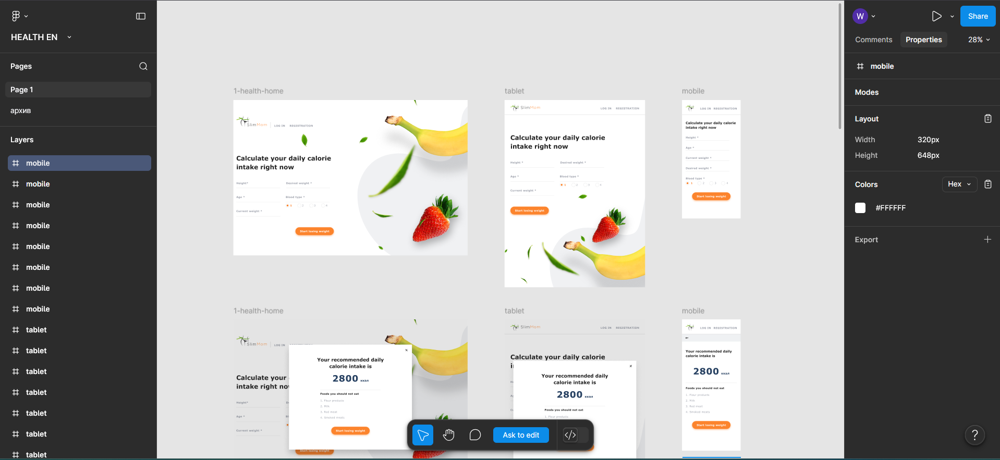
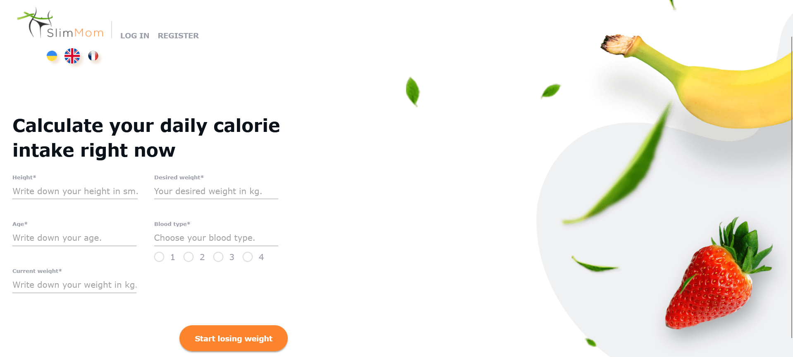

# Final Project: SlimMom – Web Application Testing

This repository showcases my work as a Functional Tester in a collaborative final project named **SlimMom**. The application is a health-tech tool designed for mothers to manage weight loss, track caloric intake, and monitor restricted food products.

## Project Overview
* **Team Name**: Bojowe Kaczuszki
* **Role**: QA Tester (Team of 6: TL, Scrum Master, 4 Testers)
* **Duration**: 1 week (intensive sprint)
* **Testing Strategies**: Model-based (calculators) & Methodical (standard failures)
* **Methodology**: Agile/Scrum

---

## Design vs Final Implementation
To ensure high-quality visual standards, I performed a thorough comparison between the original Figma designs and the final application interface.

| Design (Figma Prototype) | Final Implementation (App UI) |
| :---: | :---: |
|  |  |

---

## Testing Scope & Technologies
* **Testing Types**: Static Analysis, Dynamic Testing, API Testing (Swagger), Manual Functional Testing, Black-Box Testing.
* **Test Environment**: 
    * **My Station**: Windows 10, Mozilla Firefox (v. 120.0.1)
    * **Cross-platform coverage (Team)**: Android 13, iOS 17, macOS 12.
* **Key Areas Tested**: Registration/Login flows, Calorie Calculator, Diary/History, Prohibited Products List.

## Key Achievements & Contributions

### 1. API & Dynamic Testing (Swagger)
I was responsible for verifying the API layer using Swagger. I identified and reported **4 critical bugs** regarding response handling:
* Inability to receive correct POST/GET/DELETE responses in specific endpoints.
* Header navigation issues (Logo redirection bug).

### 2. Static Testing of Documentation
Before executing tests, I performed a deep-dive static analysis of the specification. 
* Identified **22 defects** in documentation (Missing info, Logic errors, Redundancies, UX flaws).
* Categorized defects by type (Design, Logic, Performance, Human Factor) to help improve requirements before development.

### 3. Functional Testing
Verified core application features based on the Figma design and technical specifications, including:
* Validation of mandatory fields in the calculator (Weight, Height, Age, Target Weight).
* Modal window behaviors and "Start Losing Weight" CTA functionality.

---

## 📂 Testing Artifacts (Work Samples)
Below are selected samples of my work, demonstrating various testing techniques and documentation standards:

* **Static Testing & Requirements Analysis**: 
  [View Analysis Screenshot](assets/static-testing-requirements.png) | [**Download Full Report (PDF)**](static-testing/static-testing-requirements.pdf)
* **API Testing & Verification**: 
  [Swagger Checklist](assets/api-swagger-checklist.png) | [Sample API Bug Report](assets/api-bug-report.png)
* **UX & Accessibility Insights**: 
  [Accessibility Audit Notes](assets/ux-analysis.png)
* **Quality Metrics & Statistics**: 
  [Defect Distribution Chart](assets/defect-distribution-chart.png)

---

## 🚨 Notable Bug Discovery (Security Risk)
The team discovered a **critical security flaw** in the registration process. The application allowed account creation without email verification and accepted non-existent email addresses. 
* **Risk**: Vulnerability to bot-spam and potential DDoS attacks.
* **Impact**: High priority recommendation for immediate fix due to security and database integrity risks.

---

## 📂 Full Project Documentation
For a deep dive into the project, feel free to explore the repository folders:

* 📁 [**Bug Reports**](./bug-reports) - Full set of documented defects
* 📁 [**Test Checklists**](./test-checklists) - Comprehensive lists for API and functional testing
* 📁 [**Project Presentation**](./project-presentation) - Full sprint summary presentation
* 📁 [**Static Testing**](./static-testing) - Detailed breakdown of specification flaws and PDF report
* 📁 [**App Previews**](./app-previews) - UI vs Design comparison files

---
